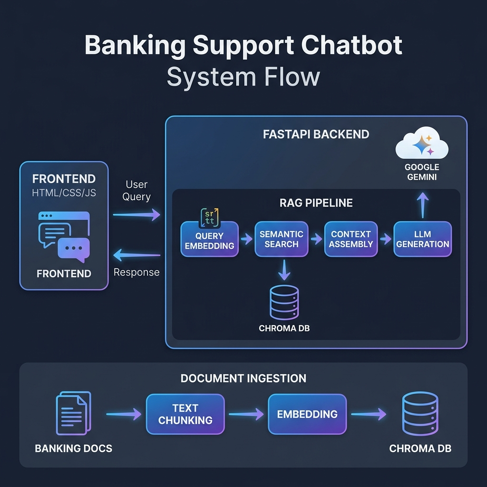

# 🏦 BankAssist AI — GenAI Banking Support Chatbot

An AI-powered Banking Support Chatbot built with **Retrieval-Augmented Generation (RAG)** that provides accurate, context-aware answers to banking-related customer queries.


---

## 🎯 Features

- **🤖 RAG-Powered Responses** — Retrieves relevant banking documents and generates context-aware answers using Google Gemini
- **🗄️ Vector Database** — ChromaDB for semantic storage and similarity search of banking knowledge
- **💬 Interactive Chat Interface** — Modern, dark-themed UI with real-time typing indicators
- **📚 Comprehensive Knowledge Base** — Covers loans, credit cards, savings accounts, digital payments, KYC, and more
- **🔄 Session Management** — Maintains conversation history for contextual follow-up questions
- **📱 Responsive Design** — Works seamlessly on desktop and mobile
- **🔍 Source Attribution** — Shows which documents were referenced for each answer

---

## 🏗️ Architecture



```
┌─────────────────────────────────────────────────────────────┐
│                        Frontend                              │
│  ┌─────────────┐  ┌──────────────┐  ┌───────────────────┐  │
│  │  Chat UI     │  │  Session Mgmt │  │  Markdown Render  │  │
│  │  (HTML/CSS)  │  │  (JS)         │  │  (JS)             │  │
│  └──────┬───────┘  └──────┬───────┘  └───────────────────┘  │
│         └────────┬─────────┘                                 │
└──────────────────┼──────────────────────────────────────────┘
                   │  HTTP/REST
┌──────────────────┼──────────────────────────────────────────┐
│                  │     Backend (FastAPI)                      │
│  ┌───────────────▼──────────────┐                            │
│  │       API Router              │                            │
│  │  POST /api/chat               │                            │
│  │  GET  /api/sessions/:id/hist  │                            │
│  │  GET  /api/health             │                            │
│  └───────────────┬──────────────┘                            │
│                  │                                            │
│  ┌───────────────▼──────────────────────────────────────┐   │
│  │              RAG Pipeline                              │   │
│  │                                                        │   │
│  │  ┌─────────┐    ┌───────────┐    ┌─────────────────┐ │   │
│  │  │ Semantic │───▶│  ChromaDB  │    │  Google Gemini   │ │   │
│  │  │ Retriever│    │  (Vector   │    │  (LLM Response   │ │   │
│  │  │          │◀───│   Store)   │───▶│   Generation)    │ │   │
│  │  └─────────┘    └───────────┘    └─────────────────┘ │   │
│  │                                                        │   │
│  │  ┌─────────────────────────────────┐                   │   │
│  │  │     Document Ingestion          │                   │   │
│  │  │  Load → Chunk → Embed → Store   │                   │   │
│  │  └─────────────────────────────────┘                   │   │
│  └────────────────────────────────────────────────────────┘   │
└──────────────────────────────────────────────────────────────┘
```

### RAG Flow

1. **Document Ingestion** (Startup):
   - Banking documents (`.md` files) are loaded from `backend/data/banking_knowledge/`
   - Text is split into overlapping chunks (500 chars, 50 overlap) respecting paragraph boundaries
   - Each chunk is embedded using `all-MiniLM-L6-v2` sentence-transformers
   - Embeddings are stored in ChromaDB with cosine similarity index

2. **Query Processing** (Runtime):
   - User question is embedded using the same model
   - Top-5 most similar chunks are retrieved from ChromaDB
   - Retrieved context + conversation history are formatted into a prompt
   - Google Gemini generates a grounded, context-aware response

---

## 🛠️ Tech Stack

| Component | Technology |
|-----------|-----------|
| **Backend Framework** | FastAPI (Python 3.11) |
| **LLM** | Google Gemini 2.0 Flash |
| **Embeddings** | sentence-transformers (`all-MiniLM-L6-v2`) |
| **Vector Database** | ChromaDB (persistent, cosine similarity) |
| **Frontend** | Vanilla HTML, CSS, JavaScript |
| **Deployment** | Render (Docker) |

---

## 🚀 Setup & Installation

### Prerequisites
- Python 3.11+
- Google API Key ([Get one here](https://aistudio.google.com/app/apikey))

### Local Development

1. **Clone the repository**:
   ```bash
   git clone https://github.com/yourusername/banking-support-chatbot.git
   cd banking-support-chatbot
   ```

2. **Create virtual environment**:
   ```bash
   python -m venv venv
   source venv/bin/activate  # macOS/Linux
   # or: venv\Scripts\activate  # Windows
   ```

3. **Install dependencies**:
   ```bash
   pip install -r backend/requirements.txt
   ```

4. **Set up environment variables**:
   ```bash
   cp .env.example .env
   # Edit .env and add your GOOGLE_API_KEY
   ```

5. **Run the application**:
   ```bash
   cd backend
   python -m uvicorn app.main:app --reload --host 0.0.0.0 --port 10000
   ```

6. **Open in browser**: Navigate to `http://localhost:10000`

### Docker

```bash
# Build
docker build -t bankassist-ai .

# Run
docker run -p 10000:10000 -e GOOGLE_API_KEY=your_key_here bankassist-ai
```

---

## ☁️ Cloud Deployment (Render)

### One-Click Deploy

1. Push the code to a GitHub repository
2. Go to [Render Dashboard](https://dashboard.render.com)
3. Click **New → Web Service**
4. Connect your GitHub repo
5. Render will auto-detect the `render.yaml` configuration
6. Add the `GOOGLE_API_KEY` environment variable
7. Deploy!

### Manual Setup on Render

1. Create a new **Web Service**
2. Set **Runtime** to **Docker**
3. Set **Dockerfile Path** to `./Dockerfile`
4. Add environment variable: `GOOGLE_API_KEY`
5. Set **Health Check Path** to `/api/health`
6. Deploy

---

## 📁 Project Structure

```
Banking Support Chatbot/
├── backend/
│   ├── app/
│   │   ├── __init__.py
│   │   ├── main.py              # FastAPI app + lifespan + static serving
│   │   ├── config.py            # Pydantic settings from env vars
│   │   ├── rag/
│   │   │   ├── ingestion.py     # Document loading, chunking, indexing
│   │   │   ├── embeddings.py    # Sentence-transformers wrapper
│   │   │   ├── retriever.py     # Semantic search in ChromaDB
│   │   │   └── generator.py     # Gemini LLM response generation
│   │   ├── routes/
│   │   │   ├── chat.py          # Chat API endpoints
│   │   │   └── health.py        # Health check endpoint
│   │   └── models/
│   │       └── schemas.py       # Pydantic request/response models
│   └── data/
│       └── banking_knowledge/   # Banking documents (Markdown)
│           ├── savings_accounts.md
│           ├── loans.md
│           ├── credit_cards.md
│           ├── digital_banking.md
│           └── banking_faqs.md
├── frontend/
│   ├── index.html               # Chat interface
│   ├── style.css                # Dark theme + glassmorphism
│   └── script.js                # Chat logic + API client
├── Dockerfile
├── render.yaml                  # Render deployment config
├── .env.example
├── .gitignore
└── README.md
```

---

## 🔌 API Reference

### `POST /api/chat`
Send a message and receive an AI response.

**Request:**
```json
{
  "message": "What is the eligibility for a home loan?",
  "session_id": "optional-session-id"
}
```

**Response:**
```json
{
  "response": "For a home loan, the eligibility criteria include...",
  "session_id": "sess_abc123",
  "sources": [
    {
      "content": "Home Loan eligibility...",
      "source": "loans.md",
      "relevance_score": 0.89
    }
  ],
  "timestamp": "2024-01-01T00:00:00"
}
```

### `GET /api/sessions/{session_id}/history`
Retrieve conversation history for a session.

### `DELETE /api/sessions/{session_id}`
Clear a conversation session.

### `GET /api/health`
System health check with RAG pipeline status.

---

## 📊 Knowledge Base Coverage

| Topic | Document | Details |
|-------|----------|---------|
| Savings Accounts | `savings_accounts.md` | Types, interest rates, KYC, digital banking |
| Loans | `loans.md` | Home, personal, education, vehicle, gold loans |
| Credit Cards | `credit_cards.md` | Types, charges, billing, EMI, security |
| Digital Banking | `digital_banking.md` | UPI, NEFT, RTGS, IMPS, net/mobile banking |
| Banking FAQs | `banking_faqs.md` | KYC, FD, RD, ombudsman, insurance, policies |
| Insurance | `insurance.md` | Life, health, home, motor, crop insurance |

---

## 🔒 Security Considerations

- API keys are loaded from environment variables (never hardcoded)
- CORS is configured for the deployment domain
- Input validation via Pydantic models (max 2000 characters)
- No personal/financial data is collected or stored
- Session data is in-memory only (ephemeral)

---

## 🚧 Future Improvements

- [ ] Persistent session storage (Redis/PostgreSQL)
- [ ] Streaming responses (SSE)
- [ ] Multi-language support (Hindi, regional languages)
- [ ] Voice input/output
- [ ] Document upload for custom knowledge base
- [ ] User authentication
- [ ] Analytics dashboard
- [ ] Rate limiting
- [ ] Automated testing suite

---

## 📝 License

This project is built for educational/assessment purposes.
