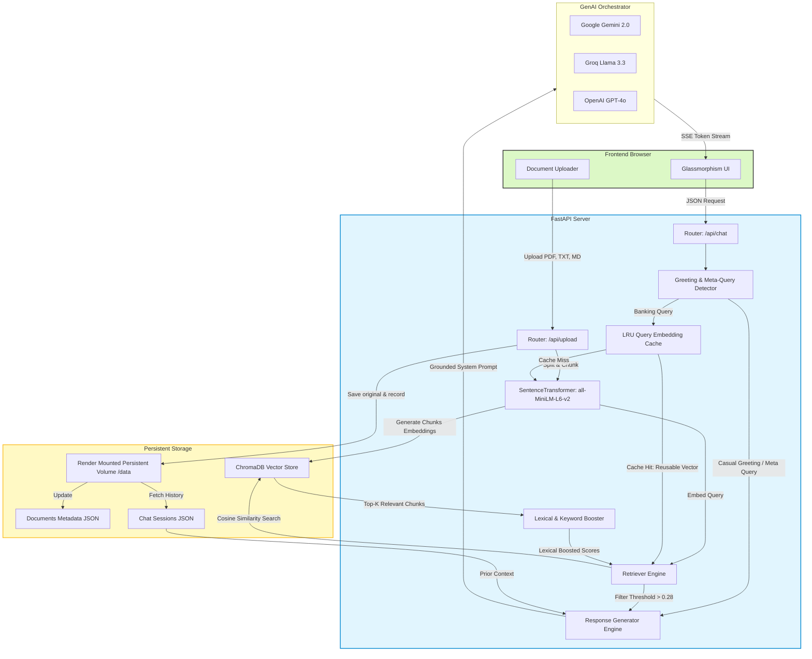

# 🏦 BankAssist AI — Enterprise-Grade Banking Support Chatbot with RAG

An advanced, production-ready AI-powered Banking Support Chatbot built using **Retrieval-Augmented Generation (RAG)**. It delivers context-grounded, low-latency, and highly reliable answers to user queries on savings accounts, credit cards, loans, digital banking, and more, while strictly minimizing hallucinations.


## 🏗️ Architecture & Pipeline Flow

The system consists of a highly optimized **FastAPI Backend** and a premium **Vanilla JS & CSS Glassmorphism Frontend**. 

### 1. Unified Architecture Diagram



### 2. Core Pipelines & Features

#### 📚 Document Ingestion (Offline & Live)
- **Sliding-Window Chunking:** Splits documents (`.md`, `.txt`, `.pdf`) into overlapping chunks (default `500` characters, `50` overlap) while preserving paragraph boundaries to maintain structural context.
- **Embedding Generation:** Uses local `sentence-transformers/all-MiniLM-L6-v2` to output 384-dimensional cosine-normalized vectors.
- **Vector Storage:** Persists embeddings in **ChromaDB** with an HNSW Index.
- **Automatic Auto-Initialization:** If the Render persistent volume (`/data`) is empty on startup, the backend automatically copies the default knowledge base files into it and performs initial indexing.

#### 🔍 RAG Retrieval & Hybrid Boosting
- **LRU Query Caching:** Caches query vector calculations (using `@functools.lru_cache`) to speed up identical repeated questions, reducing processing latency.
- **Lexical Boosting:** Combines semantic cosine similarity search with exact-keyword boosting to ensure high-priority documents match queries containing specific terminology.
- **Dynamic Calibration:** Applies a calibrated relevance threshold (`0.28`) to block out-of-domain queries while capturing broad banking questions.

#### 💬 Chat Execution & Fallback Paths
- **Greeting Bypass:** Lightweight detector redirects casual chats ("hi", "how are you") directly to the LLM, bypassing ChromaDB to save latency and prevent false warnings.
- **Weak-Context Fallback:** If queries have no matching chunks in ChromaDB, the system triggers a conversational fallback. Instead of a hard error, it provides a list of relevant banking topics available in the knowledge base.
- **State Persistence:** Multi-turn chat histories are preserved as JSON files in a dedicated persistent directory on disk.

---

## 🛠️ Configuration & Environment Variables

All settings are configured using Pydantic Settings from the `.env` file. Below is the list of available configurations:

| Variable | Default Value | Description |
|----------|---------------|-------------|
| `LLM_PROVIDER` | `gemini` | LLM provider to use (`gemini`, `groq`, or `openai`) |
| `GEMINI_API_KEY` | `""` | Google AI Studio api key |
| `GROQ_API_KEY` | `""` | Groq Console api key |
| `OPENAI_API_KEY` | `""` | OpenAI platform api key |
| `LLM_MODEL` | `gemini-2.0-flash` | The specific model identifier (e.g. `llama-3.3-70b-versatile` for Groq) |
| `CHUNK_SIZE` | `500` | Target character size for text chunking |
| `CHUNK_OVERLAP` | `50` | Character overlap between adjacent chunks |
| `TOP_K_RESULTS` | `5` | Number of documents retrieved for RAG context |
| `MIN_RELEVANCE_THRESHOLD`| `0.28` | Cosine similarity threshold for filtering RAG sources |
| `LLM_TIMEOUT` | `20.0` | Timeout in seconds for LLM API calls |
| `LLM_MAX_RETRIES` | `3` | Maximum retry attempts for failed LLM calls |
| `DATA_DIR` | `backend/data/banking_knowledge`| Directory for knowledge base files |
| `CHROMA_PERSIST_DIR` | `backend/chroma_db` | Storage path for ChromaDB indices |
| `SESSIONS_DIR` | `backend/data/sessions` | Storage path for JSON session files |
| `METADATA_PATH` | `backend/data/documents_metadata.json`| Path to document indexing metadata |
| `CORS_ORIGINS` | `*` | Allowed CORS domains (comma-separated list, e.g. `https://my-app.vercel.app`) |

---

## 🔌 API Specification

Full interactive Swagger documentation is available locally at `http://localhost:10000/docs` and Redoc at `/redoc`.

### 1. `POST /api/chat`
Submit a message and receive a streaming Server-Sent Events (SSE) response.

**Request Body:**
```json
{
  "message": "What interest rates are offered on savings accounts?",
  "session_id": "sess_123456"
}
```

**SSE Stream Events:**
- `event: metadata` — Returns session configurations, prompt lengths, and retrieved sources.
- `event: token` — Emits word tokens as they are generated by the LLM.
- `event: done` — Signals completion and provides full source attribution objects.

### 2. `POST /api/upload`
Upload and index a custom document (PDF, TXT, or MD) to the knowledge base.

**Form Data:**
- `file`: Binary file.

**Response (Success):**
```json
{
  "status": "success",
  "message": "Successfully indexed interest_rates.pdf",
  "filename": "interest_rates.pdf",
  "chunks_added": 12,
  "total_indexed_chunks": 96
}
```

**Response (Duplicate Blocked):**
```json
{
  "detail": "A document named 'interest_rates.pdf' already exists in the knowledge base."
}
```

### 3. `GET /api/documents`
List all currently indexed documents in the database.

**Response:**
```json
[
  {
    "filename": "savings_accounts.md",
    "upload_time": "2026-05-22T14:50:00Z",
    "file_size": 2405,
    "chunk_count": 8
  }
]
```

### 4. `DELETE /api/documents/{filename}`
Remove a document and its corresponding vector embeddings from ChromaDB.

### 5. `GET /api/sessions/{session_id}/history`
Fetch the full conversation history for a given session.

### 6. `GET /api/health`
Return system diagnostics, active database status, and LLM configuration settings.

---

## 🚀 Setup & Local Installation

### Prerequisites
- Python 3.11+
- An API Key for Gemini, Groq, or OpenAI.

### Step-by-Step Local Launch
```bash
# 1. Clone the project
git clone https://github.com/your-username/banking-support-chatbot.git
cd "Banking Support Chatbot"

# 2. Set up virtual environment
python -m venv venv
source venv/bin/activate

# 3. Install requirements
pip install -r backend/requirements.txt

# 4. Configure env variables
cp .env.example .env
# Edit .env and enter your key (e.g. GROQ_API_KEY) and select LLM_PROVIDER

# 5. Start the server
cd backend
python -m uvicorn app.main:app --reload --host 0.0.0.0 --port 10000
```
Open **`http://localhost:10000`** in your browser to interact with the system.

---

## ☁️ Production Deployment

### 1. Deploy Backend on Render

This project includes a `render.yaml` configuration that automatically sets up a **Docker-based Web Service** with a **Persistent Disk** to preserve indexed files and chat history.

1. Create a free account on [Render](https://render.com).
2. Connect your GitHub repository to Render.
3. Select **Blueprint** deployment (Render will read `render.yaml` automatically).
4. Add your LLM keys in the Render Dashboard environment settings (e.g., `GROQ_API_KEY`).
5. Render will deploy the backend, mount the persistent volume `/data`, and automatically index the default documents on first boot.

### 2. Deploy Frontend on Vercel

The frontend is a lightweight static single-page application. You can deploy it to **Vercel** in two ways:

#### Option A: Monorepo Deployment (Recommended)
Deploy the entire repository folder to Vercel. Vercel will use the root `vercel.json` to handle routes:
1. Connect your repository to [Vercel](https://vercel.com).
2. Select the repository root directory as the deployment root.
3. Edit the root `vercel.json` to point the `destination` URL to your deployed Render service:
   ```json
   {
     "source": "/api/:path*",
     "destination": "https://<your-render-app>.onrender.com/api/:path*"
   }
   ```
4. Deploy! Vercel will serve `/frontend` assets and proxy all `/api` requests to Render.

#### Option B: Folder-level Deployment
Alternatively, you can configure Vercel to build only the `frontend` folder:
1. In Vercel, set the **Root Directory** setting to `frontend`.
2. Edit `frontend/vercel.json` to point the `/api` rewrite to your Render service:
   ```json
   {
     "source": "/api/:path*",
     "destination": "https://<your-render-app>.onrender.com/api/:path*"
   }
   ```
3. Deploy! Vercel will build and serve just the static files, routing API calls correctly.

---

## 🧪 Testing

To run the complete automated test suite locally:

```bash
# Verify general LLM, RAG, and persistence refinements
venv/bin/python scratch/test_refinements.py

# Verify document uploads, duplicate locks, and deletions
venv/bin/python scratch/test_document_management.py
```


